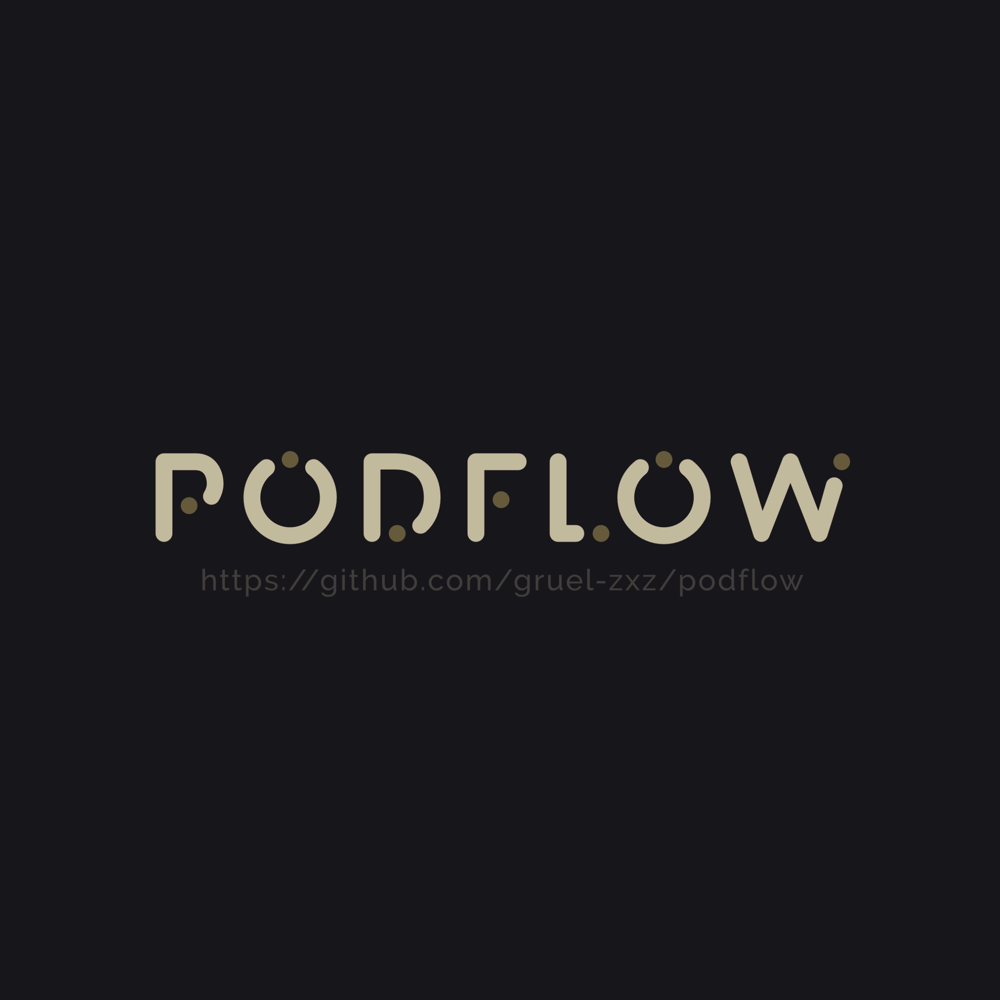

# Podflow

使用workflow在iOS上建立Podcast服务器，用于下载YouTube和哔哩哔哩的音视频并导入到Podcast中。

需要用到a-shell或者mini a-shell
   <https://www.icloud.com/shortcuts/54213ea7e46b4b21b7a0bce02f9c64a1>
或者使用Podflow.py，来获取音视频。
YouTube的cookies需要使用chrome插件导出Netscape格式并保存到channel_data文件夹中
PS:可能存在大量未知bug，改进中并尝试加入抖音……

<pre>
{
    "preparation_per_count": 100,
    "completion_count": 100,
    "retry_count": 5,
    "url": "http://127.0.0.1",
    "port": 8000,
    "port_in_url": true,
    "httpfs": false,
    "title": "Podflow",
    "filename": "Podflow",
    "link": "https://github.com/gruel-zxz/podflow",
    "description": "在iOS平台上借助workflow和a-shell搭建专属的播客服务器。",
    "icon": "https://raw.githubusercontent.com/gruel-zxz/podflow/main/Podflow.png",
    "category": "TV &amp; Film",
    "token": "",
    "delete_incompletement": false,
    "remove_media": true,
    "channelid_youtube": {
        "youtube": {
            "update_size": 15,
            "id": "UCBR8-60-B28hp2BmDPdntcQ",
            "title": "YouTube",
            "quality": "480",
            "last_size": 50,
            "media": "m4a",
            "DisplayRSSaddress": false,
            "InmainRSS": true,
            "QRcode": false,
            "BackwardUpdate": false,
            "BackwardUpdate_size": 3,
            "want_retry_count": 8,
            "title_change": [
                {
                    "mode": "add-left",
                    "match": "",
                    "url": "https://www.youtube.com/playlist?list=...",
                    "text": ""
                },
                {
                    "mode": "add-right",
                    "match": "",
                    "url": "",
                    "text": ""
                }
            ],
            "NoShorts": false
        }
    },
    "channelid_bilibili": {
        "哔哩哔哩弹幕网": {
            "update_size": 25,
            "id": "8047632",
            "title": "哔哩哔哩弹幕网",
            "quality": "480",
            "last_size": 100,
            "media": "m4a",
            "DisplayRSSaddress": false,
            "InmainRSS": true,
            "QRcode": false,
            "BackwardUpdate": false,
            "BackwardUpdate_size": 3,
            "want_retry_count": 8,
            "title_change": {
                "mode": "replace",
                "match": "",
                "text": ""
            },
            "AllPartGet": false
        }
    }
}

---

### 主配置

| 参数                  | 类型        | 默认值                                | 描述                                                                                         |
| --------------------- | ----------- | ------------------------------------- | -------------------------------------------------------------------------------------------- |
| `channelid_youtube`   | `dict`      | `{...}`                               | 可以按[YouTube频道配置](#YouTube频道配置)编写, 也可以按 `{"youtube": "UCBR8-60-B28hp2BmDPdntcQ"}` 编写, 其他参数会按默认值自动补全 |
| `channelid_bilibili`  | `dict`      | `{...}`                               | 可以按[哔哩哔哩频道配置](#哔哩哔哩频道配置)编写, 也可以按 `{"哔哩哔哩弹幕网": "8047632"}` 编写, 其他参数会按默认值自动补全 |
| `preparation_per_count` | `int`       | `100`                                 | 获取媒体信息每组数量                                                                         |
| `completion_count`    | `int`       | `100`                                 | 媒体缺失时最大补全数量                                                                       |
| `retry_count`         | `int`       | `5`                                   | 媒体下载重试次数                                                                             |
| `url`                 | `string`    | `"http://127.0.0.1"`                  | HTTP共享地址                                                                                 |
| `port`                | `int`       | `8000`                                | HTTP共享端口                                                                                 |
| `port_in_url`         | `boolean`   | `true`                                | HTTP共享地址是否包含端口                                                                     |
| `httpfs`              | `boolean`   | `false`                               | HTTP共享日志                                                                                 |
| `title`               | `string`    | `"Podflow"`                           | 博客的名称                                                                                   |
| `filename`            | `string`    | `"Podflow"`                           | 主XML的文件名称                                                                              |
| `link`                | `string`    | `"https://github.com/gruel-zxz/podflow"` | 博客主页                                                                                   |
| `description`         | `string`    | `"在iOS平台上借助workflow和a-shell搭建专属的播客服务器。"` | 博客信息                                                                                   |
| `icon`                | `string`    | `"https://raw.githubusercontent.com/gruel-zxz/podflow/main/Podflow.png"` | 博客图标                                                                                   |
| `category`            | `string`    | `"TV &amp; Film"`                     | 博客类型                                                                                   |
| `token`               | `string`    | `""`                                  | token认证, 如为null或""将不启用token                                                        |
| `delete_incompletement` | `boolean` | `false`                               | 是否删除下载中断媒体(下载前处理流程)                                                         |
| `remove_media`        | `boolean`   | `true`                                | 是否删除无用的媒体文件                                                                       |

---

### YouTube频道配置

| 参数                  | 类型        | 默认值                                | 描述                                                           |
| --------------------- | ----------- | ------------------------------------- | -------------------------------------------------------------- |
| `id`                  | `string`    | `"UCBR8-60-B28hp2BmDPdntcQ"`          | 频道ID                                                        |
| `title`               | `string`    | `"YouTube"`                           | 频道名称                                                     |
| `update_size`         | `int`       | `15`                                  | 每次获取频道媒体数量                                           |
| `quality`             | `string`    | `"480"`                               | 媒体分辨率(仅在media为视频时有效)                              |
| `last_size`           | `int`       | `50`                                  | 媒体保留数量                                                 |
| `media`               | `string`    | `"m4a"`                               | 下载媒体类型                                                 |
| `DisplayRSSaddress`   | `boolean`   | `false`                               | 是否在Print中显示子博客地址                                    |
| `InmainRSS`           | `boolean`   | `true`                                | 是否在主博客中                                               |
| `QRcode`              | `boolean`   | `false`                               | 是否显示子博客地址二维码(仅在DisplayRSSaddress为True时有效)     |
| `BackwardUpdate`      | `boolean`   | `false`                               | 是否向后更新                                                 |
| `BackwardUpdate_size` | `int`       | `3`                                   | 向后更新数量(仅在BackwardUpdate为True时有效)                  |
| `want_retry_count`    | `int`       | `8`                                   | 媒体获取失败后多少次后重试                                    |
| `NoShorts`            | `boolean`   | `false`                               | 是否不下载Shorts媒体                                         |
| `title_change`        | `list`      | `[]`                                  | 标题文本修改规则                                              |

---

### 哔哩哔哩频道配置

| 参数                  | 类型        | 默认值                                | 描述                                                           |
| --------------------- | ----------- | ------------------------------------- | -------------------------------------------------------------- |
| `id`                  | `string`    | `"8047632"`                           | 频道ID                                                        |
| `title`               | `string`    | `"哔哩哔哩弹幕网"`                     | 频道名称                                                     |
| `update_size`         | `int`       | `25`                                  | 每次获取频道媒体数量                                           |
| `quality`             | `string`    | `"480"`                               | 媒体分辨率(仅在media为视频时有效)                              |
| `last_size`           | `int`       | `100`                                 | 媒体保留数量                                                 |
| `media`               | `string`    | `"m4a"`                               | 下载媒体类型                                                 |
| `DisplayRSSaddress`   | `boolean`   | `false`                               | 是否在Print中显示子博客地址                                    |
| `InmainRSS`           | `boolean`   | `true`                                | 是否在主博客中                                               |
| `QRcode`              | `boolean`   | `false`                               | 是否显示子博客地址二维码(仅在DisplayRSSaddress为True时有效)     |
| `BackwardUpdate`      | `boolean`   | `false`                               | 是否向后更新                                                 |
| `BackwardUpdate_size` | `int`       | `3`                                   | 向后更新数量(仅在BackwardUpdate为True时有效)                  |
| `want_retry_count`    | `int`       | `8`                                   | 媒体获取失败后多少次后重试                                    |
| `AllPartGet`          | `boolean`   | `false`                               | 是否提前获取分P或互动视频                                     |
| `title_change`        | `dict`      | `{}`                                  | 标题文本修改规则                                              |

---
